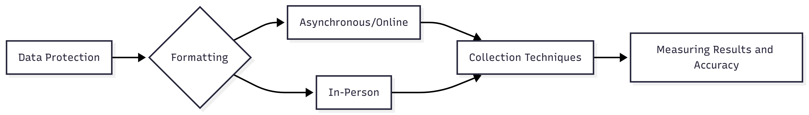
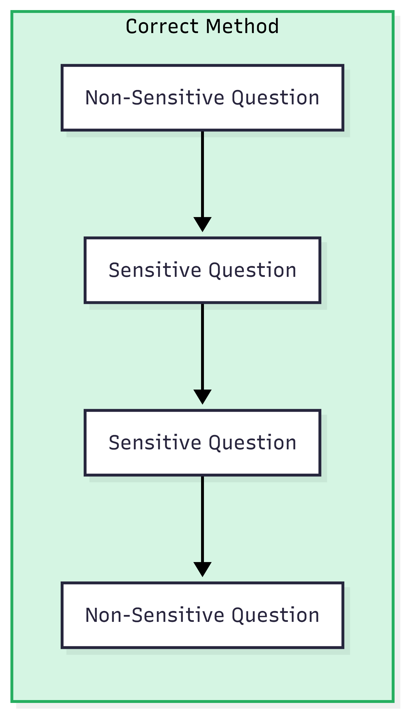
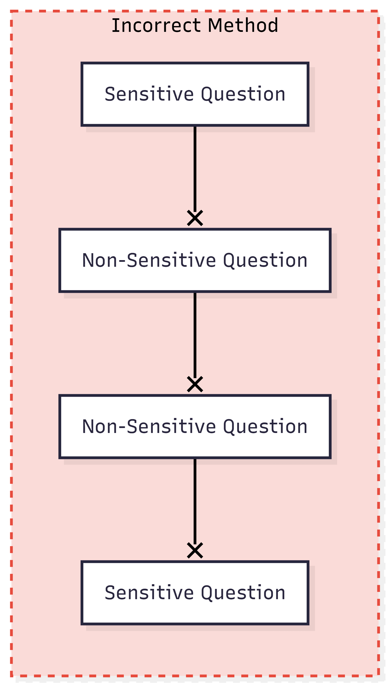
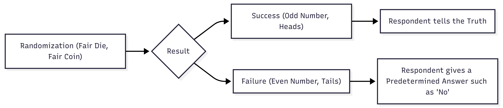

# Introduction

In survey design, researchers and analysts will sometimes want to examine some of the under-the-surface aspects of a population. Large businesses want to examine the financial standings of a city's residents to see if a new store would be able to generate profits. Insurance providers want to understand the health of their customers to understand potential future risks and to provide adequate preventive care. Pollsters want to understand the political leanings of key swing districts for an upcoming election. No matter the goal, collecting accurate data can often be very difficult because respondents are wary of the nature of these studies. As a result, respondents often like to misrepresent their true behavior to make themselves appear like better people. The effects of this phenomenon, known as sensitivity, can make analyzing the results of surveys particularly difficult and even potentially misleading in some scenarios.

The goal of this user guide is thus to guide you through the process of understanding what sensitivity is, how it can bias the results, and provide some strategies you can use to combat its effects.


## Definitions

For the purposes of this user guide, it is helpful to clearly define the terms that will be used throughout this guide.

[**Sensitivity**]{style="background-color: #FFFF00;"} - A survey question is deemed sensitive whenever a respondent's answer can be seen as socially undesirable, personally intrusive, or result in a potential detrimental outcome if someone else were to find out about the respondent's answer. What makes sensitivity especially difficult to deal with is the fact that sensitivity is inherently subjective. What one person finds sensitive could be seen as a perfectly reasonable thing to ask about to another. However, there are a few general topics that, more often that not, people will deem to be sensitive no matter the circumstance, including:

-   Religious and Political Beliefs

-   Personal Health

-   Income and Finances

-   Sexual Activity

-   Criminal Record and Illegal Activity

-   Academic Standing and Record

Note that this list is by no means exhaustive.

This user guide focuses on two types of biases: misreporting bias and nonresponse bias. These are the two most common forms of bias when dealing with sensitive questions, and both can negatively impact the reliability of your results.

[**Misreporting Bias**]{style="background-color: #FFFF00;"} - Answers given by a respondent that do not accurately reflect their lived experiences. This occurs because respondents want to downplay or not admit to participating in socially undesirable habits. Depending on the type of question asked, misreporting bias can either artificially increase or decrease the true value.

*Examples*:

-   A respondent says that they only smoke 1 cigarette per day when they actually smoke 3 cigarettes per day. (Artificially Decreasing the True Value)

-   A respondent says that they work out 7 times per week when they actually work out 2 times per week. (Artificially Increasing the True Value)

-   A respondent rounds their height in inches as a multiple of 10 because it is easier to reference [@Shuang-Ming-Height].

[**Nonresponse Bias**]{style="background-color: #FFFF00;"} - Respondents choose not to provide any response to a question. This occurs because respondents feel that revealing any answer may cause negative social ramifications. Nonresponse bias can be especially troubling for surveyors because a single nonresponse (known as *unit nonresponse*) can cause a chain reaction of multiple nonresponses (known as *chain nonresponse*) throughout the rest of the survey.

The unique challenge that these two biases present for researchers is that they are not independent, as shown in @fig-inverse-nonresponse. When researchers try to suppress the effect of nonresponse, if often results in an increase in misreporting, and the same is true in reverse. This is because when respondents are told that not responding isn't an option, they often will misreport instead to try and conceal the truth. Likewise, if respondents are told not to misrepresent themselves, they often will choose not to respond to sensitive questions instead. This creates an inverse relationship between the two bias types, which makes eliminating both bias types nearly impossible. That being said, the goal of this user guide is to help suppress the effects of these biases, even if full elimination is not possible.

```{r}
#| echo: false
#| results: "asis"
#| message: false
#| warning: false
#| label: fig-inverse-nonresponse
#| fig-cap: There is an inverse relationship between misreporting bias and nonresponse bias. When participants are forced to respond, they will tend to misreport, but when accuracy in reporting is emphasized, participants will tend to leave questions blank.

par(pty = "s", mar = c(2.5, 2.5, 2, 0.5), mgp = c(1.2, 0, 0))
x<-seq(1, 10, length.out=50)
y<-1-x
plot(x=x,
     y=y,
     type="l",
     lwd=3,
     axes=FALSE,
     xaxs = "i",
     yaxs = "i",
     xlab="Nonresponse Bias Rate", 
     ylab="Misreporting Bias Rate")
axis(side = 1, labels = FALSE)
axis(side = 2, labels = FALSE)
box()

```

## Prerequisites

Before addressing the matter of sensitive questions themselves, some pre-requisite knowledge is needed. It is assumed for this user guide that:

1.  There is an existing survey template/outline being used (Online Survey (Google Forms/Microsoft Forms) or Physical In-Person Survey Design). The format of a survey is critical to understanding the potential impacts of sensitivity. This will not be a tutorial about how to design surveys in general, but certain aspects of this user guide relate to the overall structure of the survey.

2.  There is a clear set of underlying question(s) that the survey is aiming to address. In other words, the goal(s) of the survey are clear and well defined. This may seem obvious, but the goal(s) of the survey are a useful tool to help analyze possible changes that can be made to reduce the effects of sensitivity.

3.  The audience/target population of the survey is known and clearly defined. When designing the survey, understanding the response group can help provide some insights before anyone has a chance to reply. This research should only be preliminary, as the survey will help identify more specific population characteristics of interest. To help with this preliminary research, ask yourself the following questions:

    -   Is the target population known for having a higher percentage of people that identify as falling under a particular ethnicity or religion?
    -   What historical or current events are uniquely associated with this population?
    -   What are some common traditions, customs, or beliefs held by this target population?
    -   Is the population of interest known to hold certain political beliefs? If so, what are they?

Now that you understand the basics and pre-requisites, we can begin examining the process of handling sensitive questions in surveys, which is outlined in @fig-sensitive-question-path.

{#fig-sensitive-question-path}

# Survey Design Considerations

## Data Protection

No matter the method and format you decide to use, it is important to have a [**clear privacy policy**]{.underline} in place that can be easily communicated to your respondents in word and/or in speech. This privacy policy should include specific mentions of the following:

-   [Privacy Policy]{.underline} - Will respondents be allowed to control what data is being collected?

-   [Confidentiality Policy]{.underline} - Will respondents' identifying information be separated from their responses?

-   [Anonymity Policy]{.underline} - Will researchers collect any identifying information (Name, Address, Birthday, etc.)

::: callout-important
## Confidentiality vs Anonymity

Confidentiality and anonymity are often lumped in together as the same thing when it comes to survey design, and it can be easy to confuse the two.

- **Confidentiality** means that researchers will know which person correlates to a set of responses.
- **Anonymity** means that researchers will only have access to the total pool of responses, and they will be unable to connect respondents to responses directly.

Confidentiality policies and anonymity policies are not the same thing, so make sure to include distinct mentions of each policy.

:::

Multiple studies have repeatedly shown that respondents' awareness of anonymity policies can significantly reduce the rate of misreporting [@ongImpactAnonymityResponses2006]. When respondents feel comfortable in the handling of their data, it allows them to feel that the environment they are sharing personal information in is safe and respected.

When creating these policies, clearly outline how respondents' information will be used, stored, and protected. The most important part about the surveyor-respondent relationship is maintaining a strong sense of trust. Without this belief, there is a much higher risk of misreporting or nonresponse bias. Make sure that this information is readily available to every participant throughout the survey process, especially before the survey begins.

If at any point a respondent requests you to clarify or restate any of these privacy policies, do so. Maintaining a trustworthy relationship is the primary goal to ensure the highest quality data.


## Format and Modality

The format of a survey can have a significant impact on the effects of sensitivity. Based on the type of formatting used for the survey, different approaches will be needed.

### Online/Virtual

For online surveys, an asynchronous or self-administered format will produce much higher accuracy rates compared to virtual meetings. As noted by author and survey science researcher Ting Yan, "Self-administered modes of data collection include mail surveys, web surveys, audio computer-assisted self-interviewing surveys, paper and pencil questionnaires, and so on. Unlike interviewer-administered surveys, self-administration eliminates the need to verbally report answers to sensitive questions to an interviewer and removes respondents’ concerns about privacy and looking good in front of the interviewer. Furthermore, self-administration also reduces the risk of someone else overhearing the answer" [@yanConsequencesAskingSensitive2020].

The other option for an online format (that cannot be done asynchronously) comes in the form of virtual meetings. These involve a surveyor speaking with a respondent directly through voice or video calls. Because self-administration is not an option in this type of survey, there is one key consideration to take note of, a phenomenon known as the Bystander Effect.

::: callout-warning
### The Bystander Effect

In both virtual and in-person settings, be cautious of the respondent's environment. If there are other people in the room, there is a high risk of response interference from the **Bystander Effect** ^[The definition for Bystander Effect used in this Guide is the one used in [@yanConsequencesAskingSensitive2020], and it is different from the one used in the field of social psychology.], which can dramatically increase the rate of misreporting bias. This phenomenon occurs because respondents don't want to share sensitive information about themselves with others in the room, even with close family members or friends, because they fear negative social consequences. If possible, encourage all bystanders to leave the area in which the respondent is providing answers. If the respondent is completing the survey asynchronously, strongly encourage them to complete the survey away from others.
:::

### In-Person

For in-person formats, your goal is to create an environment that the respondent feels comfortable speaking about sensitive topics in. Clearly state your privacy policies to the respondent so they can understand how the information they are providing will be protected. Ask them if they have any questions about these policies before you start the survey.

Additionally, the Bystander Effect is a key consideration. If possible, limit the number of people present with the respondent to the smallest possible. In some cases, it will be impossible to remove all non-respondents from the area. For example, a parent may insist on sitting in for a discussion with their child. If this occurs, politely explain that them not being present will improve the accuracy of the survey. If they still insist despite your recommendation, your remaining options consist of understanding that the results you collect may be influenced by a form of bias, or removing the child as a valid datapoint from the study after completing the survey.

# Sensitive Data Collection Techniques

After understanding your format, you can now begin to look at collection methods. Fortunately, these methods will work across any of the previously mentioned formats. These methods can be selected at your own discretion based on the type of sensitive question.

## Universal Guidelines
<!--Even when selecting different techniques, there are a few universal guidelines to follow:-->

Regardless of the technique selected or the sensitivity of the topic, it is important to use these best practice guidelines for writing questions.

-   Avoid using unfamiliar vocabulary or jargon in your questions. Make the question easily understandable so that the respondent knows exactly what you are asking about.
-   If you need to ask a complex question, try breaking the question down into simpler, easy-to-answer parts. You can compile these results for analysis afterwards, but try not to overwhelm your respondents with one giant question.
-   If possible, provide supplementary material that may help respondents answer questions.

    - If you are asking about an event that took place in the past, see if you can identify a date, location, and/or time. As psychologist Roger Tourangeau states, "Reporting errors due to incorrect dating seem to arise through several distinct mechanisms. People may make incorrect inferences about timing based on the accessibility (or other properties) of the memory, incorrectly guess a date within an uncertain range, and round vague temporal information to prototypical values (such as 30 days)" [@tourangeauPsychologySurveyResponse2000].
    - If the question involves units, clearly state what the unit is (amount, time, location).

## Sensitive Question Placement

Place sensitive questions towards the middle of a survey, as it allows trust to form between the respondent and the survey with early questions, while not back-loading all of the sensitive questions at the end that can make the respondent feel that the survey as a whole was a facade used to only get answers for the sensitive question(s). An exception to this rule concerns questions that ask about a respondent's identifying characteristics. As noted by researcher Maddie Brown, it is best to have these questions at the end of the survey [@HandlingSensitiveQuestions], as these types of questions can often lead to chain nonresponse if placed towards the beginning of a survey.

::: {#fig-sensitive-question-placement layout-ncol=2}





It is important to place sensitive questions in the middle of a survey. In longer surveys, it is reasonable to mix sensitive and non-sensitive questions as long as they are placed in the middle of the survey.

:::

In @fig-sensitive-question-placement, notice that the sensitive questions for the correct model are placed in the middle of the survey sequence, while for the incorrect model, they are found at the beginning and end. Note that the sensitive questions don't necessarily need to be placed directly one after another, as this model only represents a 4-question survey. For longer surveys, the goal is to centralize most, if not all sensitive questions towards the middle of the survey. Non-sensitive questions can be interspersed within the middle of the survey as well.

[*Best Uses*]{.underline}: All Sensitive Question Types. As mentioned previously, an exception is made for sensitive questions that focus on demographics, as it is best to put those at the end of the survey.

## Priming

When phrasing sensitive questions, try placing a forgiven tone or provide an outlet for saving face. Show to the respondent that you are aware of, and still respect, options that may not be the most socially desirable.

::: {.callout-note title="Example"}
Our local community center recently held its annual community picnic day on June 23rd. We know that everyone has busy lives these days, and we understand that it can easy to forget upcoming events or just run out of time to attend them. With this in mind, which of the following best describes you?

-   I did not attend this event.
-   I thought about attending, but I did not attend this year.
-   I have intended in the past, but I did not attend this year.
-   I was in attendance.
:::

In this example, note that there are several responses that help the respondent "save face" (the middle 2 responses). By providing these options, it allows the respondent to feel that even if they didn't attend the event, they can provide an answer that they believe in still socially desirable. If the goal of this survey is to measure the community's attendance rate, this still allows for results to be accurate by lumping all the "no" responses together.

[*Best Uses*]{.underline}: Questions that focus on a respondent's ability to recall knowledge or activity (Are you aware of..., What do you know about..., Do you remember...).

## Categorical Value Ranges

Instead of asking for specific answers, provide a range of possible values that the respondent can select instead. This will give the respondent an extra layer of response anonymity while still providing useful information to the surveyor.

::: {.callout-note title="Example"}
How much money have you contributed to charitable organizations within the last year?

-   Less than \$99.99

-   \$100-\$499.99

-   \$500-\$999.99

-   Greater than \$1000
:::

In this example, providing a range allows the respondent to not worry about providing a specific amount, which they may feel uncomfortable doing. Additionally, the first option provides a range for people who didn't contribute any money to charity to conceal this fact, as it includes anyone who donated up to \$99.99.

[*Best Uses*]{.underline}: Questions that aim to capture a numerical amount in regards to sensitive activity. This works especially well with income and money-based questions.

## Randomized Response Technique (RRT)

Before answering each sensitive question, a random, fair, and binomial (2-option) event occurs. Based on the result of that random event, the respondent either answers the question honestly or provides an answer that allows them to conceal the truth.

{#fig-guide-rrt}

In the example shown in @fig-guide-rrt, the randomization tool and the "success" and "failure" outcomes can be customized. For instance, you may choose to flip what defines a success or failure, or use an alternative randomization method such as a random number generator.

::: callout-important
### Limitations of RRT

If you are using RRT, it is important to understand that because you do not know whether or not a "no" is an accurate reflection of the respondent's behavior, the result is a smaller useful sample size. Whether or not the respondent says "no" honestly or not is unknown to you, so these answers must be discarded. Additionally, if you want the estimates to remain the same after using RRT, the sample size used will need to be expanded to account for the use of pre-determined responses. For example, the sample size will need to be 2x as large using a fair coin randomization method, as about half of all responses will result in the pre-determined response and lose their reliability.
:::

[*Best Uses*]{.underline}: In-person or virtual meeting formats work best for RRT, because there is usually a surveyor involved who can perform the randomization in front of the respondent and conveys the results to them. This method also works best for questions whose response is binary (yes or no).

::: {.aside}

For more information about Randomized Response, consider checking out this resource created by [Graeme Blair, Kosuke Imai, and Yang-Yang Zhou](http://www.tandfonline.com/doi/full/10.1080/01621459.2015.1050028.).

:::

## Item Count Technique (ICT)

This method involves randomly assigning respondents with a list of possible options to a question, including an option that directly correlates with the sensitive question. The respondent is then asked to state how many options apply to them, without specifying which responses apply, creating a count variable.

::: {.callout-note title="Example A:  Control"}
How many of the following statements accurately represent you?

-   I have attended a local community event.
-   I have a kid in local public school.
-   I utilize the city's hiking trails.
-   I read the local newspaper.

:::

::: {.callout-note title="Example B: Treatment"}
How many of the following statements accurately represent you?

-   I have attended a local community event.
-   I have a kid in public school.
-   I read the local newspaper.
-   I utilize the city's hiking trails.
-   I have donated to a local charity.
:::

In this example, the respondent is randomly assigned to answer one of the two question designs. Example B includes an additional option regarding whether or not the respondent has donated to charity. This is the driving sensitive question the question aims to look into, but the respondent's answer to this question is concealed by the count variable the question actually asks for. In this case, the count variable is the number of responses that accurately represent them, which may or may not include the sensitive item. The prevalence rate of the sensitive activity, in this case donating to a local charity, can be measured as the difference is sample means between the Treatment and Control. For example, if the mean of Count A (The Control) was 2.7 and the mean of Count B was 3.1, the estimated proportion of respondents who donate to charity would be (3.1-2.7) = 0.4 = 40%. This is because random assignment creates samples that will be roughly equivalent behaviorally, so the difference in score can be entirely attributed to the extra option (the sensitive question/response).

[*Best Uses*]{.underline}: Questions that focus on social behavior such as sexual activity, use of political rights such as voting, physical exercise, and illegal activity.

::: {.aside}

For more information about Item Count, consider checking out this resource created by [Alessandra Gaia](https://methods.sagepub.com/foundations/download/item-count-technique#:~:text=on%20sensitive%20topics.-,The%20Technique,are%20rele-%20vant%20for%20you.&text=I%20grew%20up%20in%20England.&text=I%20have%20visited%20Melbourne.&text=I%20have%20seen%20the%20movie%20Pulp%20Fiction.&text=I%20have%20taken%20cocaine%20or,which%20items%20apply%20to%20them.&text=%C2%AF%20xa%20+%20s%20is%20the,a'%20plus%20the%20sensitive%20item.&text=%C2%AF%20xa%20is%20the%20average,counted%20in%20list%20'a'.).

:::

## Bogus Pipeline Technique (BPT)

This method involves convincing the respondent that their answers can be verified through an external source. When using BPT, note that it does not require actually consulting an external source to verify the data, as the goal is just to convince the respondent that answers can be validated using an external source.

::: {.callout-note title="Example"}
We are able to cross-reference these results with a database of voter participation. That being said, did you participate in last year's local election?

-   Yes
-   No
:::

In this example, the respondent is being conditioned to believe that a false answer would have negative consequences, as their response can be validated. They are thus more likely to give their honest answer, even if you do not actually have their voter participation records.

::: callout-important
### Limitations of BPT

When using BPT, if a respondent knows that their answer cannot be validated for some reason, or knows that you do not actually have an external source to verify their statements, the relationship of trust between you and the respondent can be completely eroded. As a result, it may lead to chain nonresponse or chain misreporting, invalidating the respondent's entire set of answers.
:::

[*Best Uses*]{.underline}: Questions that focus on social behavior such as sexual activity, use of political rights such as voting, physical exercise, and illegal activity.

------------------------------------------------------------------------

# Measuring Results

After collecting the data, it is useful to collect some baseline measurements of the survey's effectiveness. When it comes to analyzing the results, it can be helpful to examine the impact each bias type could have on the result.

## Nonresponse Bias

The easiest way to measure nonresponse rates is to measure the percentage of N/A responses. These are responses that are either left unanswered for written surveys, or the respondent refused to provide a proper answer to for verbal or written surveys. For example, if you have a total of 500 responses from 50 people, and 100 total responses can be classified as "N/A", the nonresponse rate would be 20%. The lower this percentage, the better.

It is also a good idea to examine chain nonresponse. If the data was collected anonymously, it will be impossible to measure this. However, in cases where the response can be attributed to each respondent, check a random sample of respondents to see if they have multiple instances of nonresponse. If this is the case, it may be best to remove this respondent from the data analysis as their information may be unreliable.

## Misreporting Bias

Unfortunately there is no easy way to measure misreporting bias effects for sensitive questions without having access to some form of external verification data. While it is impossible to measure, there are a few exploratory methods you can use instead:

-   Examine the data for potential outliers: Randomly select a sample of responses, and cross-check the results with the question. If the question is open-ended, does the response seem plausible? Some respondents may choose to provide nonsensical answers in response to sensitive questions, so check to see if any exist. If they do, remove the data point from your analysis.

-   If the data you are analyzing relates to income or activity, try analyzing the shape of the distribution to see if it makes sense logically. For example, if you are analyzing an income plot, it will normally be a right-skewed distribution, with higher income earners being a much smaller percentage of the total population. The shape of the distribution will depend on the characteristics of the population you are sampling from, so check your preliminary research for what you believe these characteristics should be.
